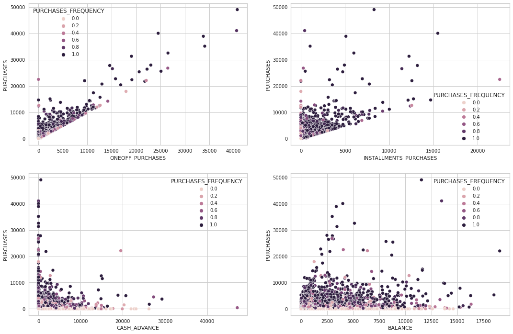
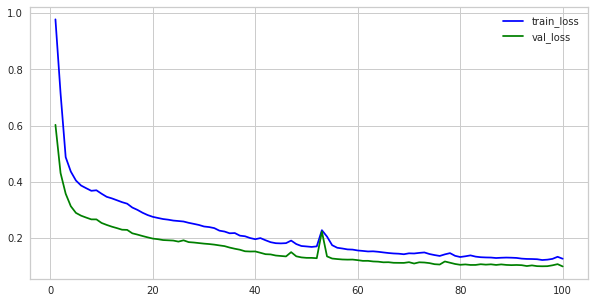
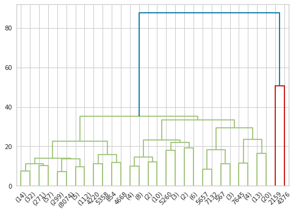
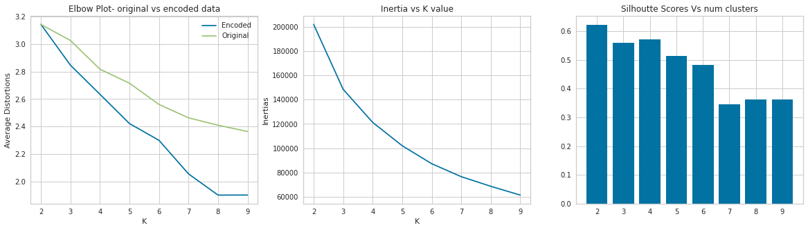
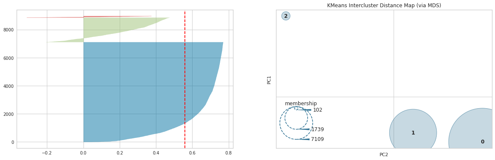
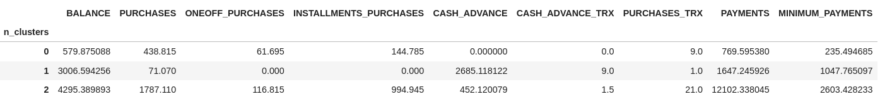

# Clustering Customers Based on Behavioral Attributes

The objective of this project is to develop a clustering model to segment customers based on various behavioral attributes, in order to formulate a marketing strategy.
These attributes pertain to usage of behavior of credit card users for a period of 6 months 

  
 There are 18 attributes for 9000 customers. Following is the data dictionary for this dataset: 

  
  
  - **CUST_ID** : Identification of Credit Card holder (Categorical)

  - **BALANCE** : Balance amount left in their account to make purchases (

  - **BALANCE_FREQUENCY** : How frequently the Balance is updated, score between 0 and 1 (1 = **frequently updated, 0 = not frequently updated)

  - **PURCHASES** : Amount of purchases made from account

  - **ONEOFF_PURCHASES** : Maximum purchase amount done in one-go

  - **INSTALLMENTS_PURCHASES** : Amount of purchase done in installment

  - **CASH_ADVANCE** : Cash in advance given by the user

  - **PURCHASES_FREQUENCY** : How frequently the Purchases are being made, score between 0 and 1 (1 = **frequently purchased, 0 = not frequently purchased)

  - **ONEOFFPURCHASESFREQUENCY** : How frequently Purchases are happening in one-go (1 = frequently **purchased, 0 = not frequently purchased)

  - **PURCHASESINSTALLMENTSFREQUENCY** : How frequently purchases in installments are being done (1 = frequently done, 0 = not frequently done)

  - **CASHADVANCEFREQUENCY** : How frequently the cash in advance being paid

  - **CASHADVANCETRX** : Number of Transactions made with "Cash in Advanced"

  - **PURCHASES_TRX** : Numbe of purchase transactions made

  - **CREDIT_LIMIT** : Limit of Credit Card for user

  - **PAYMENTS** : Amount of Payment done by user

  - **MINIMUM_PAYMENTS** : Minimum amount of payments made by user

  - **PRCFULLPAYMENT** : Percent of full payment paid by user

  - **TENURE** : Tenure of credit card service for user

### Observations from EDA

**Notable Behavioral Observation:**

- Those who have high freequency of purchases made the most purchases regardless of the balance.
- Those who have the high purchases also have the high one off purchases.
- Most of the installment purchases were made by customers with an overall low total but a high freequency of purchases. Most of the customers with low purchase freequency never made any installment purchases.
- People who made high purchases and high freequency of purchases made high installment purchases as well.
- Most of the cash advances are from folks who have made less overall purchases.
- Those with high case advance are people with low-medium balances.
- Rarely those with high purchase freequency have made high cash advances. The ones who make are people with med-high balances. In addition, those with low cash advance freequencies pay lower cash advances and have low cash advance transactions. Therefore folks with high cash transactions are those who pay more, and who have an high cash advance freequency.
- Those with high oneoff purchases have low cash advances and these are people with high installment freequencies. Therefore, those with high cash advances are ones with low one off purchases and low installments.

**Other observations from analysis:**
- There is no significant relationship between the balance amount and the number of purchases.
- Around 90% have less than 5000 purchases irrespective of the balance and the freequency of balance update.
- Only 20% of the population have a balance freequency of 0.8 or less.
- Close to 80% have a balance less than or equal to 5000.
- But those who have more than 10000 purchases are mostly users for who the balance update happens freequently. This is obvious but this also linearly grows with the balance itself.
- Customers who have a higer tenure, also generally tend to have higher balances abd credit limit. Their installment purchase freequency remains the same as customers with a lower tenure and lower purchase.
- In fact, these customer also have a higher purchase transactions compared to others.
- They also generally have a higher percentage of full payments made, and the minimum payments made by them is also generally high.

### Modelling Workflow
1. A KMeans experiment was conducted to get the optimal value of k. It was determined that there are 3-7 clusters in the data. Furthermore, this produced an unsteady elbow plot from which it was difficult to determine optimal K. 
2. An autoencoder was build with pytorch for dimensionality reduction.

3. Agglomerative clustering was done in the encoded dataset to reconfirm k.

4. Finally, a KMeans model was built with optmal k value, and with the encoded data to get final predictions.

The reason to choose k = 3 and not 4 is because, the intercluster distances become very small. 

### Visualizing the clusters with Yellobrics:

### Cluster Summary and Inference:

- The 3 clusters of customers are distinct.
- The first group are customers who maintain low balance and spend less. They often do not make many transactions, and in the case that they do, they do not spend a lot.
- The second group of customers maintain a reasonably high balance. But they do not make many transactions with their card. Instead, they opt to take cash advances and probably only use cash for transactions. This group does not use their credit card for any transaction.
- The third lot is a minority who both maintain high balance, and also make many high value purchases with their card, and spend a lot in general. They do not take much cash advances probably because their spend from debit and only use credit card for their purchases.
This result indeed reflects many intermediate observations presented in the sections above.

### Next Steps:

The final model was a KMeans Clustering algorithm with a silhoutte score of 0.56 which is not very unnacceptable. Having more clusters might not be the best idea for now as the intra-cluster distances will be very small, thereby producing an unstable decision boundary in production. However, as more data is gathered, we could have more distinct and precise clusters.
For the sake of creating targeted marketing campaigns for different customers, the current result can serve as a starting point. 
